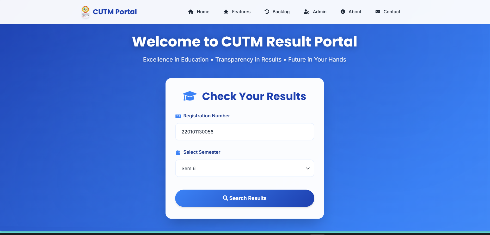
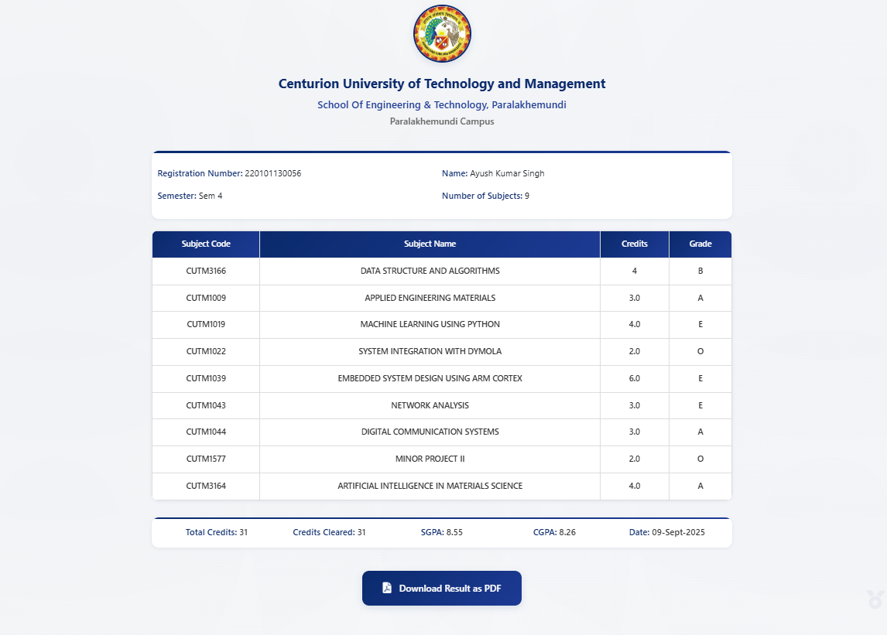
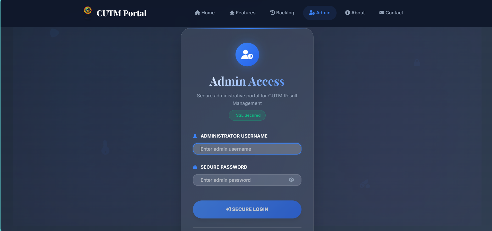
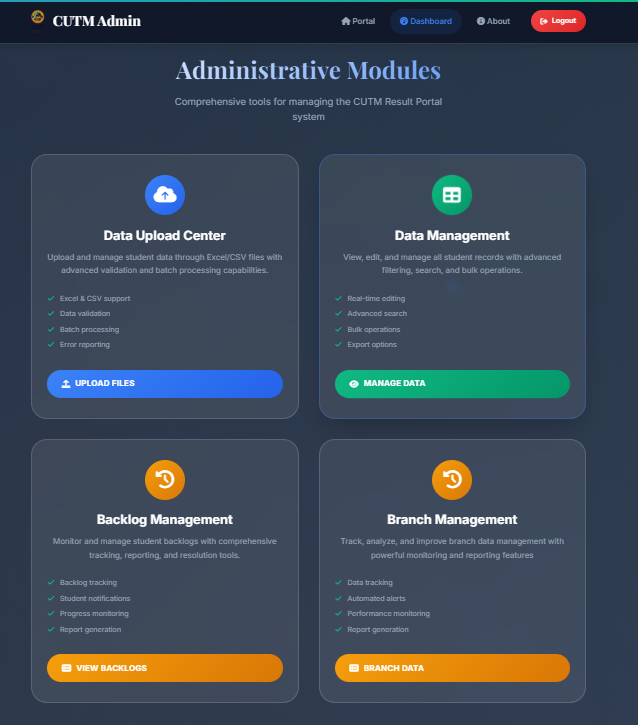
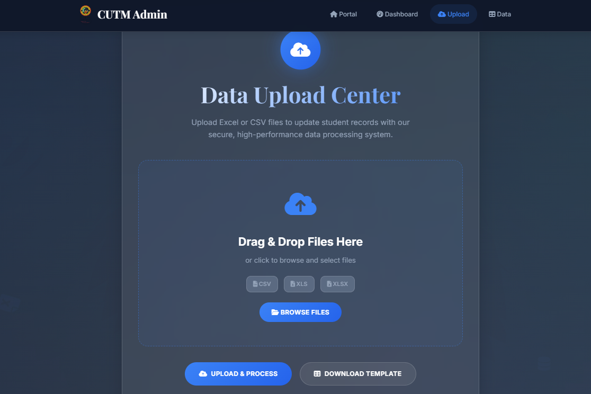
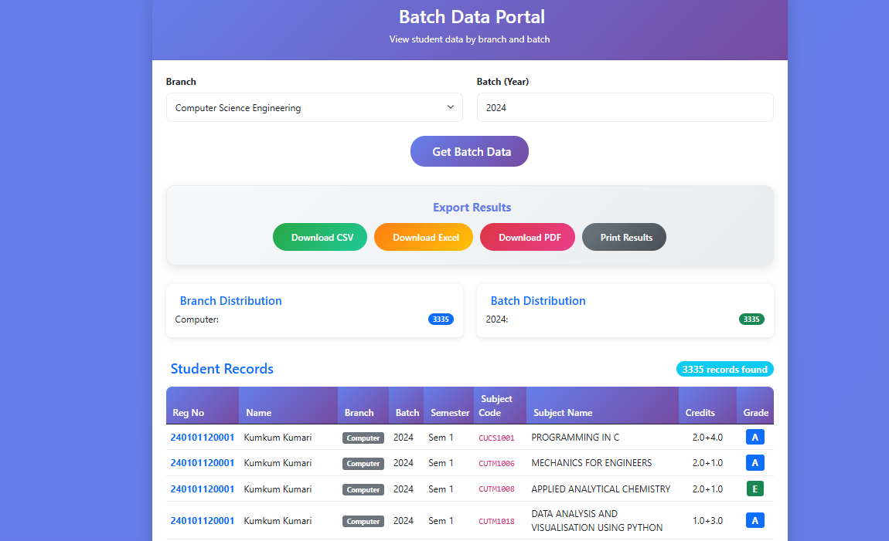
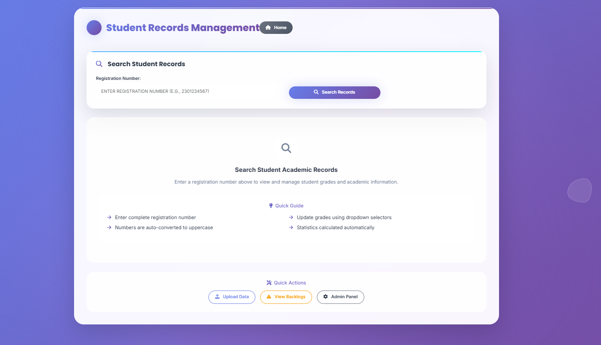
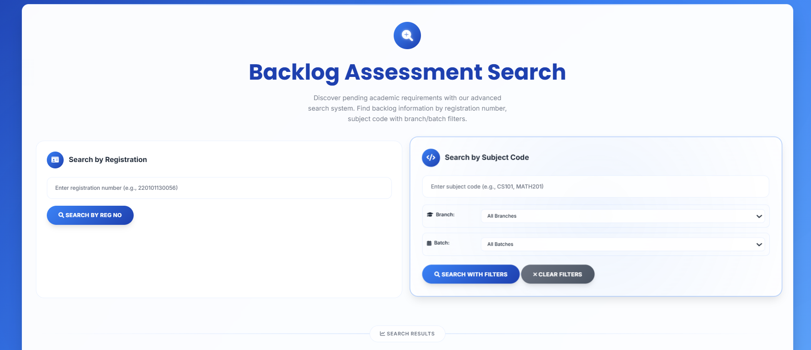

# 🎓 CUTM Student Result Management System  

A comprehensive web application for managing student academic records, built with **Flask** and **MongoDB**.  
This system provides efficient student data management with features like GPA calculation, backlog tracking, batch-wise filtering, and data export capabilities.

---

## ✨ Features  

### 🔍 Student Records Search
- Search by registration number 
- Semester-wise result filtering  
- Real-time SGPA and CGPA calculation  
- Complete academic history display  

### 📊 GPA Calculation System
- **SGPA**: Semester-wise grade point calculation  
- **CGPA**: Cumulative grade point across all semesters  
- Automatic credit calculation with multi-format support  
- Grade mapping system: *(O=10, E=9, A=8, B=7, C=6, D=5, F=0)*  

### 🎯 Backlog Management
- Track failed subjects (F, M, S, I, R grades)  
- Search by registration number or subject code  
- Branch and year-wise backlog filtering  
- Statistical analysis with visual breakdown  

### 👥 Batch-wise Data Management
- Filter students by academic year (2020–2029)  
- Branch-wise filtering *(Civil, CSE, ECE, EEE, Mechanical)*  
- Complete student records with academic performance  
- Statistical insights and analytics  

### 📁 Data Export Options
- **CSV Export**: Spreadsheet-compatible format  
- **Excel Export**: Professional worksheets with auto-formatted columns  
- **PDF Export**: Formatted reports with institutional branding  

### 🔧 Admin Panel
- Secure admin authentication  
- Bulk data upload *(CSV/Excel)*  
- Individual record updates  
- Data validation and integrity checks  

### 🏗️ Advanced Architecture
- MongoDB indexing for optimized queries  
- Branch identification from registration numbers  
- Year extraction and validation  
- Comprehensive error handling  

---

## 🛠️ Tech Stack  

**Backend**  
- Framework: Flask (Python)  
- Database: MongoDB with PyMongo driver  
- Authentication: Custom admin authentication  
- File Processing: Pandas for CSV/Excel handling  

**Frontend**  
- UI Framework: Bootstrap 5  
- Templates: Jinja2 templating engine  
- Styling: Custom CSS with professional design  
- Responsive: Mobile-friendly interface  

**Data Processing & Export**  
- `pandas` – DataFrame operations  
- `openpyxl` – Excel file generation  
- `reportlab` – PDF document creation  
- File Handling: werkzeug secure filename processing  

**Deployment & Environment**  
- Environment: python-dotenv for configuration  
- Timezone: PyTZ (IST)  
- Security: Environment variable management  

---

## 📋 Prerequisites  

- Python **3.9** or higher  
- MongoDB **4.4** or higher  
- pip (Python package installer)  

---

## 🚀 Installation & Setup  

1. **Clone the Repository**
   ```bash
   git clone https://github.com/AYUSHRAHUL/cutm-result-management.git
   cd cutm-result-management


---



## 🏠 Home Page – CUTM Result Portal

The **Home Page** is the entry point for students to check their academic results.  
It provides a simple and user-friendly interface with a focus on **transparency, education, and future readiness**.

---

### ✨ Features
- 🎓 **Check Your Results** – Enter details to access semester results  
- 🔑 **Registration Number Input** – Unique student identifier (e.g., `220101130056`)  
- 📅 **Select Semester** – Dropdown for selecting semester (e.g., *Sem 6*)  
- 🔍 **Search Button** – Fetches and displays student result instantly  
 

✅ This page ensures students can quickly **search and access results** using their registration number and semester selection.



 
This page displays **student academic results** after searching by **registration number** and **semester**.

---

## 📑 Information Displayed

### 🧑‍🎓 Student Details
- Registration Number  
- Name  
- Semester  
- Number of Subjects  

### 📊 Result Table (per subject)
- Subject Code (e.g., CUTM3166)  
- Subject Name (e.g., Data Structure and Algorithms)  
- Credits (e.g., 4.0)  
- Grade (e.g., A, B, O, E)  

### 📌 Summary Section
- Total Credits  
- Credits Cleared  
- SGPA (Semester Grade Point Average)  
- CGPA (Cumulative Grade Point Average)  
- Date of Result Generation  

### 📥 Extra Feature
- Download Result as **PDF option**  

---





# 🛠️ Admin Panel – CUTM Portal

The **Admin Panel** provides authorized users with full control over result and backlog management.  
It ensures **data transparency**, easy updates, and smooth handling of student academic records.  

---

## 📑 Features Available for Admin

### 🔐 Authentication
- Secure login for admin users.  
- Role-based access control.  

### 📝 Result Management
- Add, update, or delete student results.  
- Upload results in bulk using files (CSV/Excel).  
- Modify grades, credits, or subject details if required.  

### 📊 Backlog Management
- Track and update student backlogs.  
- Add/remove subjects from backlog records.  
- Generate backlog reports filtered by branch, batch, or subject code.  

### 📥 Reports & Downloads
- Export student results and backlog data in **PDF** or **Excel** format.  
- View analytics of **SGPA/CGPA trends** across semesters.  




# 🛠️ Admin Panel – Features

The **CUTM Admin Panel** provides tools for managing student data, results, and backlogs with advanced validation and reporting.  

---

## 📌 Main Features

### 📂 Data Upload Center
- Upload and manage student data via **Excel/CSV files**.  
- Advanced **data validation**.  
- **Batch processing** support.  
- Automatic **error reporting**.  

### 📊 Data Management
- Real-time editing of student records.  
- Advanced **search & filtering**.  
- Perform **bulk operations**.  
- Export data in different formats.  

### 📑 Backlog Management
- Track and monitor student backlogs.  
 - Progress monitoring for backlog clearance.  
- Generate **backlog reports**.  

### 🏫 Branch Management
- Track and analyze **branch-level data**.  
- **Automated alerts** for performance issues.  
- Monitor branch-wise performance.  
- Generate **branch reports**.  

---

✅ The Admin Panel ensures smooth handling of academic records, reduces manual errors, and provides transparency through automation and reports.  




# 📂 Data Upload Center – Admin Panel

The **Data Upload Center** allows admins to update student records efficiently by uploading **Excel (XLS/XLSX)** or **CSV files**.  
It ensures secure, high-performance data processing with validation and batch support.  

---

## 📑 Features
- Drag & Drop file upload or manual file selection.  
- Supported formats: **CSV, XLS, XLSX**.  
- **Data validation** before processing.  
- **Batch processing** for handling multiple records.  
- **Error reporting** for invalid entries.  
- Option to **download a template file** for correct formatting.  
- Process and save records with one click (**Upload & Process**).  

---

## ✅ Benefits
- Saves time with bulk data handling.  
- Reduces manual entry errors.  
- Provides a secure and efficient way to manage student records.  

---




## 🏫 Batch Data Portal

The **Batch Data Portal** allows administrators to view student academic records by **branch** and **batch year**.  
It provides detailed data visualization, student records, and export options.

---

### 🔍 Search & Filters
- **Branch Selector** – Choose branch (e.g., *Computer Science Engineering*)  
- **Batch Selector** – Enter batch year (e.g., *2024*)  
- **Action Button** – 🟣 **Get Batch Data**

---

### 📤 Export Results
Easily export filtered student data in multiple formats:
- 🟢 **Download CSV**  
- 🟠 **Download Excel**  
- 🔴 **Download PDF**  
- ⚫ **Print Results**  

---

### 📊 Distribution Insights
- **Branch Distribution** – Displays student count per branch  
- **Batch Distribution** – Displays student count per batch/year  

---

✅ This feature enables **batch-wise academic tracking**, **branch-level insights**, and **professional report generation**.


 




# 📖 Student Records Management

The **Student Records Management** system allows admins to search, view, and update student academic details using the registration number.  
It provides tools for managing grades, backlogs, and academic performance efficiently.  

---

## 📑 Features

### 🔍 Search Student Records
- Search by **registration number**.  
- Numbers are **auto-converted to uppercase**.  
- Quick access to complete student academic details.  

### 📝 Academic Record Management
- View **student grades** and **academic performance**.  
- Update grades using **dropdown selectors**.  
- Automatic calculation of academic statistics (SGPA/CGPA).  

### ⚡ Quick Actions
- **Upload Data** → Upload new student data from CSV/XLS/XLSX.  
- **View Backlogs** → Monitor and manage pending subjects.  
- **Admin Panel** → Access full admin controls.  

---

## ✅ Benefits
- Simplifies searching and updating student records.  
- Ensures accurate academic statistics.  
- Provides integrated shortcuts to **data upload**, **backlog tracking**, and **admin tools**.  

---



## 🔄 Backlog Assessment Search

The **Backlog Assessment Search** page allows students and administrators to track pending academic requirements with ease.  
It supports searching by **Registration Number** or **Subject Code** with advanced filters.

---

### 🔍 Search by Registration
- Enter **Registration Number** (e.g., `220101130056`)
- Get backlog information instantly
- Displays failed subjects (`F, M, S, I, R` grades)

**Action Button:**
- 🔵 **Search by Reg No**

---

### 🧾 Search by Subject Code
- Enter **Subject Code** (e.g., `CS101`, `MATH201`)
- Apply filters for:
  - **Branch** (Civil, CSE, ECE, EEE, Mechanical, etc.)
  - **Batch** (2020–2029)
- Provides branch-wise and batch-wise backlog analytics

**Action Buttons:**
- 🔵 **Search with Filters**
- ❌ **Clear Filters**

---

📌 *This feature helps administrators generate targeted backlog reports and provides transparency in student performance tracking.*


## 🤝 Contribution Guidelines

We welcome contributions! 🚀

Fork the repository
Create a new feature branch
Commit changes with descriptive messages
Push to your fork
Open a Pull Request

##🧑‍💻 Future Enhancements

📌 Student login portal
📌 Automated transcript generation
📌 Email notification system
📌 REST API for external integrations
📌 AI-powered performance prediction

##📜 License

This project is licensed under the MIT License – you are free to use, modify, and distribute.

##👨‍🏫 Author

Developed by [Ayush Kumar Singh] ✨
📧 Contact: [2201011300056#cutm.ac.in]
🔗 GitHub: AYUSHRAHUL


             
